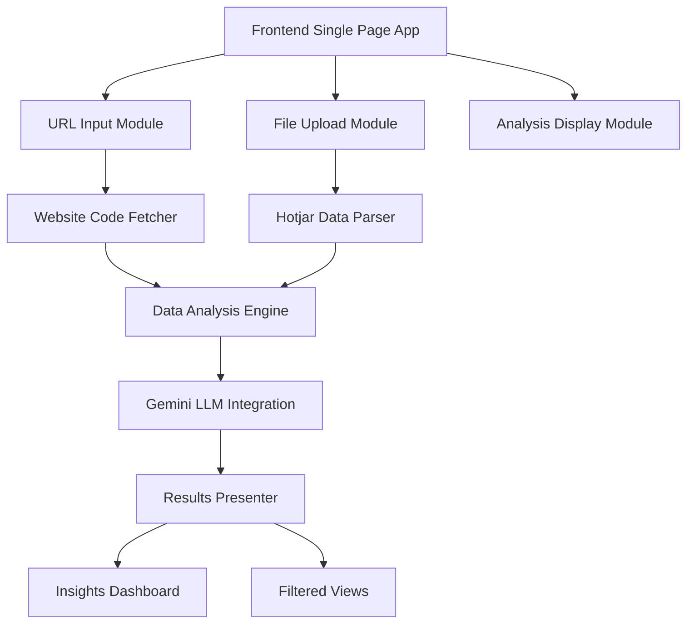

# Hotjar Heatmap Analysis Web App - Implementation Plan

## 1. Architecture Overview

The application will be structured as a single-page web application with the following core components:



## 2. Technical Stack & Design Decisions

### Frontend Stack
- **HTML/CSS/JavaScript** (Pure frontend application)
- **Tailwind CSS** for styling
  - Utility-first approach for rapid development
  - Built-in responsive design utilities
  - Modern, clean aesthetic
  - Smaller bundle size compared to alternatives

### Key Libraries
1. **Syntax Highlighting**
   - Prism.js for code display
   - Supports HTML/CSS/JS highlighting
   - Lightweight and easy to integrate

2. **File Processing**
   - Native File API for uploads
   - Papa Parse for CSV handling
   - Built-in browser capabilities where possible

3. **Network Requests**
   - Fetch API with async/await
   - CORS handling strategy
   - Robust error management

4. **Gemini AI Integration**
   - Asynchronous API calls
   - Rate limiting implementation
   - Error handling and fallbacks

## 3. Project Structure

```
hotjar-app/
├── index.html          # Main application entry
├── css/
│   └── style.css      # Custom styles (minimal with Tailwind)
├── js/
│   ├── main.js        # Application initialization
│   ├── urlHandler.js  # URL validation and fetching
│   ├── fileHandler.js # File upload and parsing
│   ├── analyzer.js    # Data analysis logic
│   ├── gemini.js      # Gemini API integration
│   └── ui.js          # UI updates and rendering
└── assets/            # Icons and static resources
```

## 4. Implementation Phases

### Phase 1: Core Setup (Day 1)
- [ ] Project structure setup
- [ ] HTML scaffold with semantic elements
- [ ] Tailwind CSS integration
- [ ] Basic responsive layout implementation

### Phase 2: Input Handling (Days 2-3)
- [ ] URL input component with validation
- [ ] File upload with drag-and-drop
- [ ] Progress indicators
- [ ] Error handling for inputs

### Phase 3: Data Processing (Days 4-5)
- [ ] Website code fetching implementation
- [ ] Hotjar CSV parsing logic
- [ ] CSS selector mapping system
- [ ] Data validation and error handling

### Phase 4: Analysis Integration (Days 6-7)
- [ ] Gemini API integration
- [ ] Analysis prompt engineering
- [ ] Results processing
- [ ] Caching implementation

### Phase 5: UI Completion (Days 8-10)
- [ ] Analysis dashboard implementation
- [ ] Filtering system
- [ ] Recommendations display
- [ ] Final styling and responsiveness

## 5. Security Measures

### Input Validation
- URL sanitization
- File type verification
- Size limits enforcement
- Input escaping

### Data Processing
- HTML sanitization
- Safe CSS selector handling
- XSS prevention
- Content Security Policy

### API Security
- Rate limiting
- API key protection
- Error handling
- Request validation

## 6. Testing Strategy

### Unit Tests
- URL validation functions
- File parsing utilities
- Data mapping logic
- UI component rendering

### Integration Tests
- API communication
- Data flow verification
- Error handling paths
- State management

### UI/UX Tests
- Responsive design verification
- User interaction flows
- Error message display
- Loading states

## 7. Performance Optimization

### Initial Load
- Minimal dependencies
- Asset optimization
- Progressive enhancement
- Lazy loading where appropriate

### Runtime Performance
- Efficient data structures
- Debounced user inputs
- Optimized DOM updates
- Memory management

## 8. Known Challenges & Solutions

### CORS Limitations
- **Challenge**: Unable to fetch website code directly from browser
- **Solution**: 
  1. Implement proxy server option
  2. Provide manual code paste alternative
  3. Clear error messaging for users

### Large File Processing
- **Challenge**: Memory constraints with large CSV files
- **Solution**:
  1. Implement chunked processing
  2. Progress indicators
  3. File size limits
  4. Clear user feedback

### API Rate Limits
- **Challenge**: Gemini API quotas and limits
- **Solution**:
  1. Request queuing system
  2. Results caching
  3. Batch processing
  4. User feedback during delays